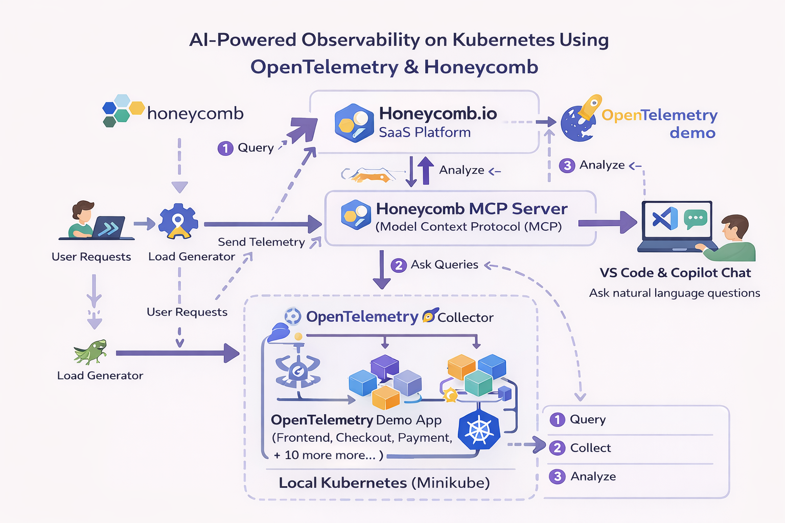

# 🚀 AI-Powered Observability on Kubernetes using OpenTelemetry & Honeycomb



## 📌 Project Overview

Modern cloud-native applications are built using microservices, where a single user request passes through many services. In such systems, debugging issues like slowness, errors, or failures becomes very difficult using traditional monitoring tools.

This project demonstrates how to build a **fully observable Kubernetes environment** using:
* **OpenTelemetry:** For collecting telemetry data (traces, metrics, logs).
* **Honeycomb:** For analyzing high-cardinality data.
* **Honeycomb MCP (Model Context Protocol):** For AI-based natural language debugging.
* **Minikube:** For running a real multi-service application locally.

With this setup, instead of manually navigating dashboards, we can ask questions in plain English like:
> *"Which service was slow in the last 30 minutes?"*
> *"Why is checkout slow today?"*

---

## 🧠 Real-Life Problem This Project Solves

| ❌ Traditional Debugging Problems | ✅ Solution with This Project |
| :--- | :--- |
| Too many scattered dashboards | Centralized telemetry (metrics, logs, traces) |
| Hard-to-write SQL/PromQL queries | AI-assisted debugging using natural language |
| No clear "why" behind failures | Request-level tracing across services |
| Slow root-cause analysis | Faster resolution using Contextual AI |

---

## 🏗️ Architecture

The flow of data in this project is as follows:
1.  **User Requests** hit the Application.
2.  **OpenTelemetry Demo App** (Microservices) generates data.
3.  **OpenTelemetry Collector** gathers traces, metrics, and logs.
4.  **Honeycomb Platform** ingests and visualizes the data.
5.  **Honeycomb MCP Server** connects the data to AI agents.
6.  **VS Code Copilot** allows us to query the data using natural language.

---

## ⚙️ Step-by-Step Implementation

### 1️⃣ Create Local Kubernetes Cluster
First, we start a local Kubernetes cluster using Minikube with enough resources to handle the microservices demo.

```bash
minikube start --cpus=4 --memory=6g --disk-size=40g

```

**Outcome:**

### 2️⃣ Configure OpenTelemetry Collector

We need to configure the Collector to send data to Honeycomb. Create a `values.yaml` file.

*Note: Replace `<YOUR_API_KEY>` with your actual Honeycomb API Key.*

```yaml
opentelemetry-collector:
  enabled: true
  config:
    receivers:
      otlp:
        protocols:
          http: {}
          grpc: {}
    processors:
      batch: {}
    exporters:
      otlphttp/honeycomb:
        endpoint: [https://api.honeycomb.io](https://api.honeycomb.io)
        headers:
          x-honeycomb-team: "<YOUR_API_KEY>"
          x-honeycomb-dataset: "otel-demo"
    service:
      pipelines:
        traces:
          receivers: [otlp]
          processors: [batch]
          exporters: [otlphttp/honeycomb]
        metrics:
          receivers: [otlp]
          processors: [batch]
          exporters: [otlphttp/honeycomb]
        logs:
          receivers: [otlp]
          processors: [batch]
          exporters: [otlphttp/honeycomb]

```

### 3️⃣ Deploy OpenTelemetry Demo Application

We use Helm to deploy the OpenTelemetry Demo, which consists of 15+ microservices (Frontend, Cart, Checkout, Currency, etc.).

```bash
helm repo add open-telemetry [https://open-telemetry.github.io/opentelemetry-helm-charts](https://open-telemetry.github.io/opentelemetry-helm-charts)
helm repo update
kubectl create namespace otel-demo
helm upgrade --install otel-demo open-telemetry/opentelemetry-demo -n otel-demo -f values.yaml

```

**Outcome:**

### 4️⃣ Verify Deployment

Initially, the pods will be in a `ContainerCreating` or `Init` state.

Wait for a few minutes and check again. All pods should be in the `Running` state.

```bash
kubectl get pods -n otel-demo

```

### 5️⃣ Access the Demo Application

To view the web store, we need to port-forward the frontend service to our local machine.

```bash
kubectl port-forward -n otel-demo svc/frontend-proxy 8080:8080

```

**Outcome:**

Now, open your browser at `http://localhost:8080`.

### 6️⃣ Traffic Generation & Analysis

The OpenTelemetry demo includes a "Load Generator" service running Locust. This simulates user traffic so we have data to analyze.

You can view the load generator stats at `http://localhost:8080/loadgen/`.

---

## 🤖 AI-Powered Debugging (MCP)

This is the most advanced part of the project. We connect our IDE (VS Code) to Honeycomb using the **Model Context Protocol (MCP)**. This allows an AI Agent to query our observability data.

### 1. Connect Honeycomb MCP

In the Honeycomb UI, navigate to Account Settings > Integrations > MCP to get your connection URL.

### 2. Configure VS Code

Add the MCP server configuration to your VS Code MCP settings file (`mcp.json`):

```json
{
  "servers": {
    "honeycomb-server": {
      "url": "[https://mcp.honeycomb.io/mcp](https://mcp.honeycomb.io/mcp)",
      "type": "http"
    }
  },
  "inputs": []
}

```

### 3. Ask Natural Language Questions

Now, open GitHub Copilot Chat in VS Code and ask questions about your live cluster data.

**Example Query:** *"List all datasets present in my honeycomb project"* or *"Why is the cart service slow?"*

---

## 🎯 What I Learned

* **Observability vs Monitoring:** Moving beyond "is it up?" to "why is it behaving this way?"
* **OpenTelemetry:** How to instrument a Kubernetes cluster with the OTel collector.
* **Helm:** Managing complex microservices deployments.
* **MCP & AI:** Bridging the gap between static dashboards and interactive AI debugging.

## 🏁 Conclusion

This project serves as a real-world blueprint for implementing observability in cloud-native systems. By integrating AI agents via MCP, we significantly reduce the **Mean Time To Resolve (MTTR)** by allowing developers to converse with their system's data.

## 🔖 Keywords

`Kubernetes` `OpenTelemetry` `Honeycomb` `Observability` `MCP` `AI Debugging` `Microservices` `Helm` `Distributed Tracing`

